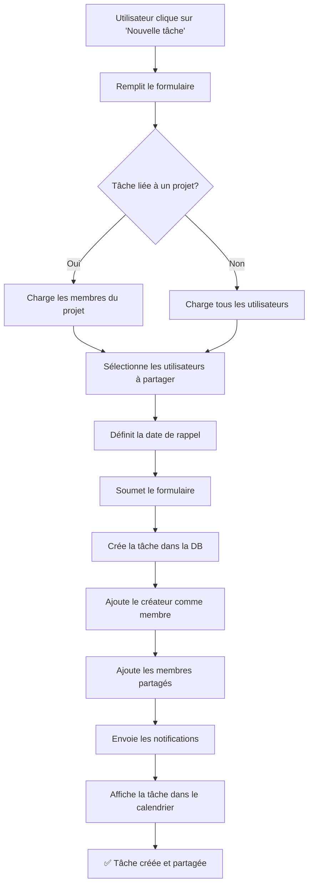

# Nouvelles Fonctionnalités - Gestion des Tâches

## Vue d'ensemble

Le module de gestion des tâches a été enrichi avec plusieurs nouvelles fonctionnalités pour améliorer la collaboration et l'organisation :

1. **Calendrier interactif** 📅
2. **Système de rappels** 🔔
3. **Barre de recherche** 🔍
4. **Partage de tâches** 👥

---

## 1. Calendrier Interactif

### Description
Un calendrier bi-mensuel visuel qui affiche toutes vos tâches organisées par date d'échéance, avec un panneau détaillé pour le jour sélectionné.

### Fonctionnalités
- **Vue bi-mensuelle** : Deux mois côte à côte pour une meilleure visibilité
- **Navigation fluide** : Boutons précédent/suivant pour changer de mois
- **Indicateurs visuels** :
  - Fond coloré (rouge clair) pour les jours avec tâches à échéance
  - Bordure ambrée épaisse pour les jours avec rappels
  - 👥 Icône pour les tâches partagées
  - 🔔 Icône pour les rappels
- **Panneau des tâches du jour** :
  - Affiche toutes les tâches du jour sélectionné
  - Informations complètes : nom, description, projet, estimation
  - Avatars des membres pour les tâches partagées
  - Clic sur une tâche pour l'éditer directement
- **Légende claire** : Explication visuelle des indicateurs

### Utilisation
1. Le calendrier s'affiche en haut de la page des tâches (2 colonnes sur grand écran)
2. Cliquez sur une date pour voir ses tâches dans le panneau de droite
3. Les jours avec tâches sont mis en évidence avec un fond coloré
4. Les jours avec rappels ont une bordure ambrée distinctive
5. Cliquez sur une tâche dans le panneau pour l'éditer
6. Utilisez le bouton "Masquer/Afficher le calendrier" pour contrôler sa visibilité

---

## 2. Système de Rappels

### Description
Configurez des rappels avec heure précise et notifications sonores pour ne jamais oublier vos tâches importantes.

### Fonctionnalités
- **Date de rappel personnalisée** : Définissez une date spécifique pour être rappelé
- **Heure du rappel** : Choisissez l'heure exacte de notification (format HH:MM)
- **Notifications automatiques** : Recevez une notification toast dans l'application
- **Notifications système** : Notifications navigateur (si autorisées)
- **Notification sonore** 🔊 : Son de notification activable/désactivable
- **Indicateur visuel** : Les tâches avec rappel affichent une icône 🔔

### Configuration
1. Lors de la création/modification d'une tâche, remplissez le champ "Date de rappel"
2. **Dès que vous sélectionnez une date**, deux nouveaux champs apparaissent :
   - **Heure du rappel** (obligatoire) : Choisissez l'heure exacte (ex: 14:30)
   - **Notification sonore** : Cochez pour activer le son (activé par défaut)
3. Une preview s'affiche : "Vous serez notifié le [date] à [heure] avec un son de notification"
4. L'icône de cloche apparaîtra à côté de la tâche dans le tableau et le calendrier

### Comment ça marche
- L'application vérifie toutes les minutes s'il y a des rappels à déclencher
- À l'heure exacte, vous recevez :
  - ✅ Une notification toast dans l'application
  - ✅ Une notification système navigateur (si autorisée)
  - ✅ Un son de notification (si activé)
- Chaque rappel n'est déclenché qu'une seule fois

### Exemples

#### Exemple 1 : Rappel simple
```
Tâche : Revue de code
Date d'échéance : 20/10/2025
Date de rappel : 18/10/2025
Heure du rappel : 09:00
Son activé : Oui
→ Vous serez notifié le 18/10/2025 à 09:00 avec un son
```

#### Exemple 2 : Rappel silencieux
```
Tâche : Réunion client
Date d'échéance : 15/10/2025
Date de rappel : 15/10/2025
Heure du rappel : 13:30
Son activé : Non
→ Notification visuelle uniquement à 13:30
```

### Autoriser les notifications système
Pour recevoir les notifications même quand l'onglet n'est pas actif :
1. Lors de la première utilisation, le navigateur demande l'autorisation
2. Cliquez sur "Autoriser" pour activer les notifications système
3. Vous pouvez modifier ce paramètre dans les paramètres du navigateur

### Icônes et indicateurs
- 🔔 **Bell** : Indique qu'un rappel est configuré
- 🔊 **Volume2** : Son de notification activé
- 🔇 **VolumeX** : Son de notification désactivé

---

## 3. Barre de Recherche

### Description
Trouvez rapidement vos tâches parmi toutes vos projets.

### Fonctionnalités
- **Recherche en temps réel** : Les résultats s'affichent au fur et à mesure que vous tapez
- **Recherche multi-critères** : Cherche dans :
  - Nom de la tâche
  - Description
  - Nom du projet
- **Effacement rapide** : Bouton ✕ pour vider la recherche

### Utilisation
1. Tapez votre requête dans la barre de recherche en haut de la page
2. Les tâches sont filtrées instantanément
3. Combinez avec le filtre de projet pour une recherche plus précise

### Astuces
- La recherche est insensible à la casse (majuscules/minuscules)
- Utilisez des mots-clés courts pour de meilleurs résultats
- Le message "Aucune tâche trouvée pour votre recherche" indique qu'aucun résultat ne correspond

---

## 4. Partage de Tâches

### Description
Collaborez efficacement en partageant des tâches avec vos collègues.

### Fonctionnalités Principales

#### 4.1 Création de Tâche Partagée
1. Lors de la création d'une tâche, cochez "Partager cette tâche avec d'autres utilisateurs"
2. Sélectionnez les utilisateurs avec qui partager :
   - Si la tâche est liée à un projet : seuls les membres du projet sont disponibles
   - Si la tâche n'a pas de projet : tous les utilisateurs sont disponibles
3. Cliquez sur "Créer" pour créer la tâche partagée

#### 4.2 Notifications Automatiques
Lorsqu'une tâche est partagée :
- **Créateur** : Reçoit une confirmation de création
- **Membres partagés** : Reçoivent une notification du type :
  ```
  "Nouvelle tâche partagée"
  "Déreck a partagé la tâche 'Développer API REST' avec vous"
  ```

#### 4.3 Visibilité des Tâches Partagées
- Les tâches partagées apparaissent automatiquement dans la liste de tous les membres
- Icône 👥 visible à côté des tâches partagées
- Colonne "Membres" affiche les avatars des participants (max 3 visibles + compteur)

### Scénario d'utilisation

**Exemple : Déreck partage une tâche avec Sarah**

1. **Déreck crée la tâche** :
   - Nom : "Revue du code de l'API utilisateurs"
   - Projet : Backend API
   - Partage avec : Sarah
   - Date d'échéance : 25/10/2025

2. **Notifications envoyées** :
   - ✅ Déreck : "Tâche créée !"
   - ✅ Déreck : "Tâche partagée avec 1 utilisateur(s)"
   - ✅ Sarah : "Nouvelle tâche partagée" + détails

3. **Affichage** :
   - La tâche apparaît dans la liste de Déreck avec l'icône 👥
   - La tâche apparaît dans la liste de Sarah avec l'icône 👥
   - Les deux voient les avatars des membres (Déreck + Sarah)
   - La tâche apparaît dans le calendrier des deux utilisateurs

4. **Collaboration** :
   - Sarah peut voir tous les détails de la tâche
   - Sarah peut suivre la progression
   - Les saisies de temps sont visibles pour tous les membres

### Permissions et Sécurité
- Seuls les membres d'un projet peuvent partager des tâches de ce projet
- Les administrateurs peuvent voir et gérer toutes les tâches
- Le créateur de la tâche a le rôle "creator"
- Les membres partagés ont le rôle "member"

---

## Structure de Données

### Modèle Task (mis à jour)
```prisma
model Task {
  id             String
  name           String
  description    String?
  projectId      String?
  dueDate        DateTime?        // ✨ NOUVEAU
  reminderDate   DateTime?        // ✨ NOUVEAU
  reminderTime   String?          // ✨ NOUVEAU - Format HH:MM
  soundEnabled   Boolean          // ✨ NOUVEAU - Par défaut: true
  isShared       Boolean          // ✨ NOUVEAU
  createdBy      String?          // ✨ NOUVEAU
  TaskMember     TaskMember[]     // ✨ NOUVEAU
  // ... autres champs
}
```

### Nouveau Modèle TaskMember
```prisma
model TaskMember {
  id        String
  taskId    String
  userId    String
  role      String  // "creator" ou "member"
  createdAt DateTime
  Task      Task
  User      User
}
```

---

## API Actions

### Nouvelles Actions Disponibles

#### `createTask`
```typescript
await createTask({
  name: "Ma tâche",
  description: "Description...",
  projectId: "project-id",
  dueDate: new Date("2025-10-25"),
  reminderDate: new Date("2025-10-23"),
  reminderTime: "14:30",           // ✨ NOUVEAU
  soundEnabled: true,              // ✨ NOUVEAU
  isShared: true,
  sharedWith: ["user-id-1", "user-id-2"]
});
```

#### `getMyTasks`
```typescript
await getMyTasks({
  projectId: "project-id",  // Optionnel
  searchQuery: "API"         // ✨ NOUVEAU - Optionnel
});
```

#### `getAvailableUsersForSharing`
```typescript
await getAvailableUsersForSharing({
  projectId: "project-id"  // Optionnel
});
```

---

## Workflow Complet

### Création d'une Tâche Partagée avec Rappel



---

## Améliorations Futures Possibles

- [ ] Édition des membres partagés après création
- [ ] Rappels récurrents (quotidien, hebdomadaire)
- [ ] Plusieurs rappels par tâche (ex: 1 semaine avant, 1 jour avant)
- [ ] Sons de notification personnalisables
- [ ] Commentaires sur les tâches partagées
- [ ] Statuts de progression (À faire, En cours, Terminé)
- [ ] Notifications par email pour les rappels
- [ ] Intégration avec le calendrier Google/Outlook
- [ ] Export des tâches en PDF/Excel
- [ ] Vue Kanban pour les tâches
- [ ] Configuration de la fréquence de vérification des rappels

---

## Support et Questions

Pour toute question ou problème concernant ces fonctionnalités :
1. Consultez d'abord cette documentation
2. Vérifiez les logs dans la console du navigateur
3. Contactez l'équipe de développement

---

**Date de mise à jour** : 13 octobre 2025  
**Version** : 1.0.0

